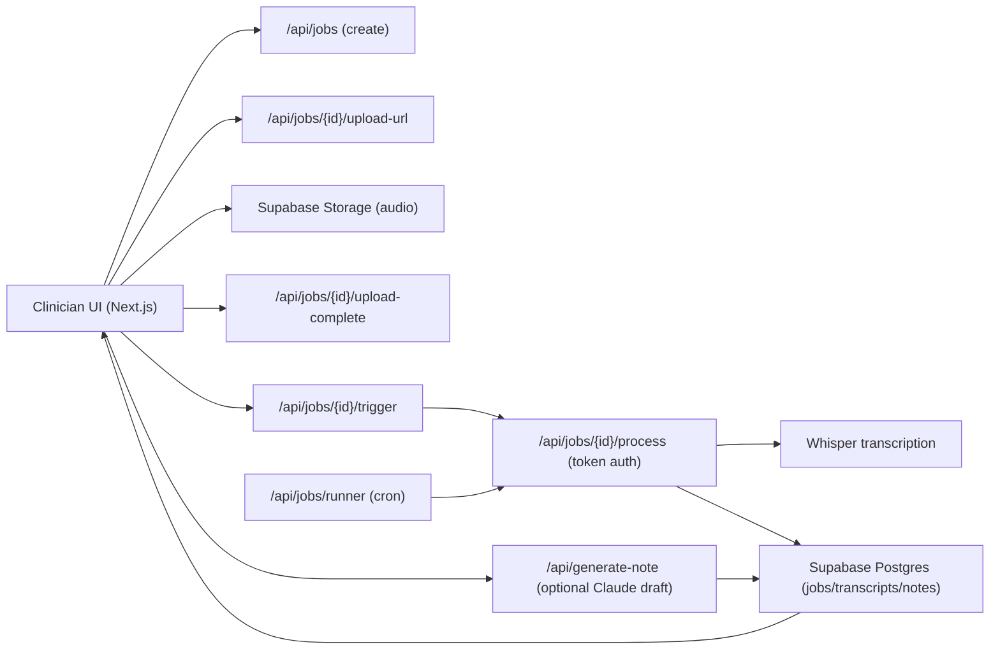

# Clinic Notes AI - Portfolio Pack

## 60-second pitch

Clinic Notes AI is a full-stack SaaS I built from scratch to help small clinics (2-5 providers) turn session audio into usable documentation.  
The workflow is: record/upload audio -> transcribe with Whisper -> extract structured EHR-ready fields -> optionally generate draft notes with Claude -> review/edit/export.  
I built and shipped this using Next.js 15, React 19, strict TypeScript, Supabase (Postgres/Auth/Storage/RLS), and Vercel, with production observability and background-job hardening.

## What I built

- Multi-tenant SaaS architecture with auth, org scoping, and role-based access.
- End-to-end AI pipeline integrating OpenAI Whisper and Anthropic Claude.
- Background job lifecycle with queue/lease processing, retry behavior, cancellation semantics, and operational runner endpoints.
- Security and governance baseline:
  - RLS-backed data isolation
  - rate limiting
  - signed uploads/URLs
  - nonce-based CSP
  - audit logging
- Delivery-quality engineering:
  - strict TS
  - CI gates (`lint`, `typecheck`, `test`)
  - structured runbooks and architecture docs.

## Technical metrics (current)

- API route files: `28`
- Test files: `50`
- Vitest status: `46 passed`, `2 skipped`
- Test count: `206 passed`, `20 skipped`
- SQL migration files: `16`

## Architecture snapshot

## High-signal engineering stories

### 1) Fixed false-failure runner alerts in production
- Problem: Sentry cron monitor showed repeated failures and "missed check-in" behavior.
- Action: reworked runner check-ins to report on all terminal code paths (`ok` and `error`), with explicit flush behavior.
- Outcome: failure signals became actionable (auth/config/runtime), instead of ambiguous missing-heartbeat noise.

### 2) Prevented premature retry exhaustion in job pipeline
- Problem: jobs could be retried before audio upload was complete.
- Action: gated queue dispatch to jobs with `audio_storage_path` present and improved process idempotency.
- Outcome: reduced avoidable failed jobs and made trigger behavior consistent under races.

### 3) Closed schema/runtime mismatch in cancellation flow
- Problem: cancellation logic used a stage value not allowed by DB constraint.
- Action: aligned schema migration + runtime lifecycle model + worker stage validation.
- Outcome: removed a production 500 risk and made cancellation semantics consistent end-to-end.

## Resume bullet options

- Built and shipped a full-stack AI SaaS (Next.js, TypeScript, Supabase, Vercel) that converts clinical session audio into structured EHR-ready documentation via OpenAI Whisper and Anthropic Claude.
- Implemented a production-grade job pipeline (queueing, leases, retries, cancellation, cron runner) and improved reliability by hardening idempotency, worker rate-limit isolation, and runner observability.
- Developed and maintained a multi-tenant security model with RLS, signed storage flows, CSP hardening, and audit logging, backed by automated test gates (206 passing tests).

## Interview framing

When discussing this project, lead with:
- product problem and user workflow,
- one technical depth area (jobs/observability/security),
- one tradeoff you made and why,
- one production issue you diagnosed and fixed.

## What to customize before sharing

- Add your deployed app URL.
- Add a 2-5 minute Loom/demo video link.
- Add your GitHub username and a one-line "my role" statement.
- Add one screenshot of the session workspace and one of job status history.
